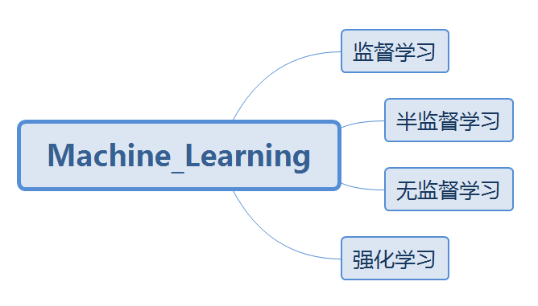
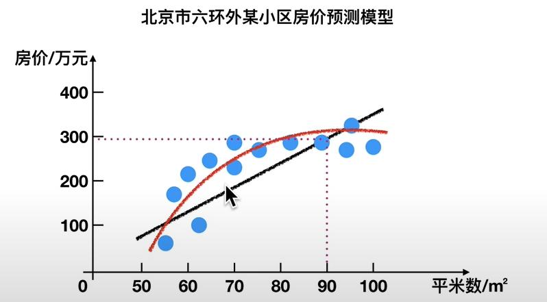
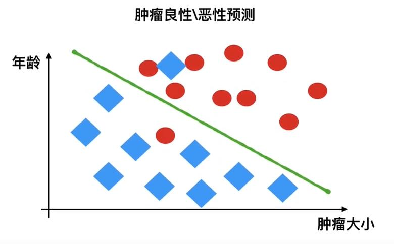
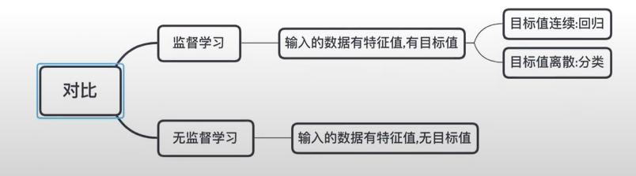
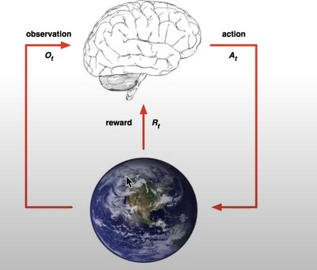

## 广义来说，有四种机器学习算法
  

### 1.监督式学习

输入数据是由输入特征值和目标值所组成。 
&nbsp;&nbsp;&nbsp;&nbsp;·函数的输出是一个连续的值（称为回归） 
&nbsp;&nbsp;&nbsp;&nbsp;·函数的输出是有限个离散值<
 

#### 1.1回归问题
例如：预测房价，根据样本集拟合出一条连续曲线。

#### 1.2分类问题
例如：根据肿瘤特征判断良性还是恶性，得到的是结果是“良性”或者“恶性”，是离散的。

### 2.无监督式学习

输入数据是由输入特征值组成，没有目标值 
&nbsp;&nbsp;·输入数据没有被标记，也没有确定的结果。样本数据类别未知； 
&nbsp;&nbsp;·需要根据样本间的相似性对样本集进行类别划分。

  

**对比**

### 3.半监督式学习

训练集同时包含有标记样本数据和未标记样本数据 

监督学习训练方式:

### 4.强化学习

定义： &nbsp;&nbsp;实质是make decisions问题，即自动进行决策，并且可以做连续决策。 
&nbsp;&nbsp;&nbsp;&nbsp;·函数的输出是一个连续的值（称为回归） 
&nbsp;&nbsp;&nbsp;&nbsp;·函数的输出是有限个离散值<
 
举例： 
&nbsp;&nbsp;小孩想要走路，但在这之前，他需要先站起来，站起来之后还要保持平衡，接下来还要先迈出一条腿，是左腿还是右腿，迈出一步后还要迈出下一步。

&nbsp;&nbsp;小孩就是agent，他试图通过采取行动（即行走）来操纵环境（行走的表面），并且从一个状态转变到另一个状态（即他走的每一步），当他完成任务的子任务（即走了几步）时，孩子得到奖励（给巧克力吃），并且当他不能走路时，就不会给巧克力。

主要包含五个元素：agent，action，reward，environment，observation；

|  | 监督学习 | 强化学习 |
| --- | --- | --- |
| 反馈映射 | 输出的是之间的关系，可以告诉算法什么样的输入对应着什么样的输出 | 输出的是给机器的反馈 reward function，即用来判断这个行为是好是坏 |
| 反馈时间 | 做了比较坏的选择会立刻反馈给算法 | 结果反馈有延时，有时候可能需要走了很多步以后知通以前的某一步的选择是好还是坏 |
| 输入特征 | 输入是独立同分布的 | 面对的输入总是在变化，每当算法做出一个行为，它影响下一次决策的输入 |

|  | In | Out | 目的 | 案例 |
| --- | --- | --- | --- | --- |
| 监督学习（supervised learning | 有标签 | 有反馈 | 预测结果 | 猫狗分类 房价预测 |
| 无监督学习（unsupervised learning | 无标签 | 无反馈| 发现潜在结构 | “物以类聚，人以群分 |
| 半监督学习（Semi-Supervised Learning | 部分有标签，部分无标签 | 有反馈| 降低数据标记的难度 |  |
| 强化学习（reinforcement learning | 决策流程及激励系统| 一系列行动 | 长期利益最大化 | 学下棋 |

### 机器学习KNN算法

KNN是一个极其简单的算法，中文叫K近邻算法。

