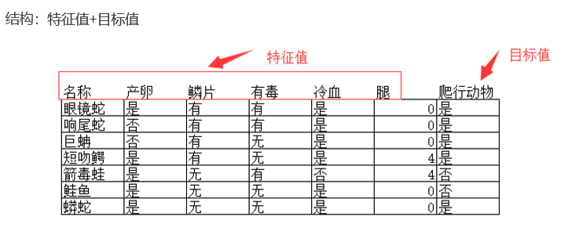
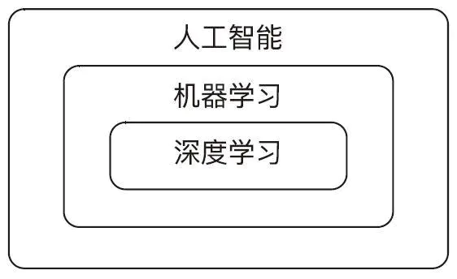
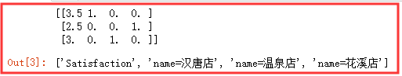
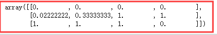
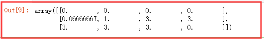
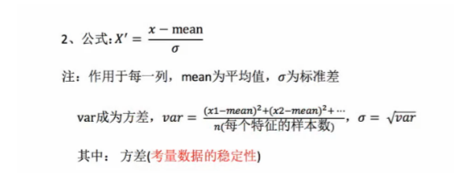
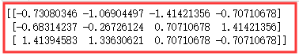
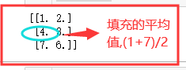
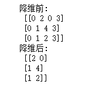
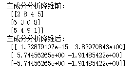

## 机器学习介绍

#### <font color='blue' face='楷体'>机器学习</font>

​	机器学习是一门多学科交叉专业，涵盖概率论知识，统计学知识，近似理论知识和复杂算法知识，使用计算机作为工具并致力于真实实时的模拟人类学习方式，并将现有内容进行知识结构划分来有效提高学习效率。

​	很难明确的定义，简单的说，机器学习就是利用数学方法和计算机技术通过对历史数据进行分析得到规律（模型），并利用规律对未知数据进行预测。

#### <font face='楷体' color='blue'>数据集</font>

​    机器学习是从历史数据获得规律，那这些历史数据是怎样的?

#### <font face='楷体' color='blue'>可以获取的数据集</font>

​	1.scikit-learn数据量较小，方便学习

​	2.kaggle大数据竞赛平台，真实数据，数据量巨大。国内类似的像阿里的天池，百度的AI Studio

​	3.UCI收录了360个数据集，覆盖生活、科学、经济等领域，数据量几十万

#### <font color='blue' face='楷体'>常见的数据集结构组成：</font><font color='red' face='楷体'>特征值+目标值</font>





  <font color='red'>注意 </font>: 有些数据集可以没有目标值 。每一行就是一个样本。 每一列就是一个特征。 最后要`预测的值`就是目标。


#### <font color='blue' face='楷体'>人工智能</font>

​	大数据人工智能技术，在应用层面包括机器学习、神经网络、深度学习等，它们都是现代人工智能的核心技术。在大数据背景下，这些技术均得到了质的提升，人工智能、机器学习和深度学习的包含关系如下图。




$
人工智能 = 算法 + 算力 + 算料
$


​	`算法`是依靠人设计的，并且可以通过<font color='red'>深度学习</font>不断的校正。因此本质上来说，算法是人的智力水平的体现。既然是人的智力水平体现，就看人才的质量了。这也是为什么硅谷出现大量AI人才的原因，因为聚集了顶级的智力资源。

​	`算力`是机器运算的快慢，因此就是硬件而已，花钱堆叠就行了。算力方面GPU具有绝对的优势，目前大部分深度学习的框架，比如`Tensorflow`，`Pytorch`都是依赖GPU来完成计算任务。

​	`算料`是给AI喂大量数据，因此谁手里有大量的数据，谁的AI模型就更准确，同时通过不断的<font color='red'>深度学习</font>反向校正算法。

#### <font color='blue' face='楷体'>scikit-learn</font>

​	**scikit-learn是基于Python语言的机器学习工具**

​	1.简单高效的数据挖掘和数据分析工具

​	2.可供大家在各种环境中重复使用

​	3.建立在Numpy，Scipy和Matplotlib上

​	4.开源，可商业使用-BSD许可证

#### <font color='blue' face='楷体'>Scikit-learn数据集API介绍</font>

```python
1. sklearn.datasets
    1.1 加载获取流行数据集
    1.2 datasets.load_*() -- 获取小规模数据集，数据包含在datasets里
    1.3 datasetss.fetch_*(data_home=None)
    获取大规模数据集，需要从网络上下载，函数的第一个参数是data_home， 表示数据集。下载目录,默认是-/scikit-learn_data/
2. load_* 和 fetch_* 返回的数据类型是datasets.base.Bunch(字典格式)
    data:特征数据数组,是[n_ samples*n_features]的二维numpy.ndarray数组
    target:标签数组,是n_samples的维numpy.ndarray数组
    DESCR:数据描述
    feature_names:特征名，新闻数据，手写数字，回归数据集没有
    target_names;标签名
    #关于第二点, load_* 用于获取小数据集 , fetch_* 用于获取大数据集
```


**scikit-learn的使用**

```python
# 导入方式
from sklearn.datasets import load_iris    # load_iris  导入是鸢尾花的数据
 
# 加载鸢尾花的数据
li = load_iris()

print('获取特征值',li.data)  # 鸢尾花的特征，官方早已分类好的，可供直接使用
print('目标值',li.target)    # 分了3个类

li.DESCR  # 鸢尾花的描述li.feature_names  # 鸢尾花的特征名  花长  花宽li.target_names  # 鸢尾花的标签名
```


```
#1 特征值  # 值太多，只复制一部分展示
获取特征值
 [[5.1 3.5 1.4 0.2]
 [4.9 3.  1.4 0.2]
 [4.7 3.2 1.3 0.2]
 [4.6 3.1 1.5 0.2]
 [5.  3.6 1.4 0.2]
 [5.4 3.9 1.7 0.4]
 [4.6 3.4 1.4 0.3]
 [5.  3.4 1.5 0.2]
 [4.4 2.9 1.4 0.2]
 [4.9 3.1 1.5 0.1]
 [5.4 3.7 1.5 0.2]
 [4.8 3.4 1.6 0.2]
 [4.8 3.  1.4 0.1]
 [4.3 3.  1.1 0.1]
 [5.8 4.  1.2 0.2]
 [5.7 4.4 1.5 0.4]
 [5.4 3.9 1.3 0.4]
 [5.1 3.5 1.4 0.3]
 [5.7 3.8 1.7 0.3]
 [5.1 3.8 1.5 0.3]
 [5.4 3.4 1.7 0.2]
 [5.1 3.7 1.5 0.4]
 [4.6 3.6 1.  0.2]
 [5.1 3.3 1.7 0.5]
 [4.8 3.4 1.9 0.2]
 [5.  3.  1.6 0.2]
 [5.  3.4 1.6 0.4]
 [5.2 3.5 1.5 0.2]
 [5.2 3.4 1.4 0.2]
 [4.7 3.2 1.6 0.2]
 [4.8 3.1 1.6 0.2]
 [5.4 3.4 1.5 0.4]
 [5.2 4.1 1.5 0.1]
 [5.5 4.2 1.4 0.2]
 [4.9 3.1 1.5 0.2]
 [5.  3.2 1.2 0.2]
 [5.5 3.5 1.3 0.2]
 [4.9 3.6 1.4 0.1]
 [4.4 3.  1.3 0.2]
 [5.1 3.4 1.5 0.2]
 [5.  3.5 1.3 0.3]
 [4.5 2.3 1.3 0.3]
 [4.4 3.2 1.3 0.2]
 [5.  3.5 1.6 0.6]
 [5.1 3.8 1.9 0.4]
 [4.8 3.  1.4 0.3]
 [5.1 3.8 1.6 0.2]
 [4.6 3.2 1.4 0.2]
 [5.3 3.7 1.5 0.2]
 
#2 目标值
目标值
 [0 0 0 0 0 0 0 0 0 0 0 0 0 0 0 0 0 0 0 0 0 0 0 0 0 0 0 0 0 0 0 0 0 0 0 0 0
 0 0 0 0 0 0 0 0 0 0 0 0 0 1 1 1 1 1 1 1 1 1 1 1 1 1 1 1 1 1 1 1 1 1 1 1 1
 1 1 1 1 1 1 1 1 1 1 1 1 1 1 1 1 1 1 1 1 1 1 1 1 1 1 2 2 2 2 2 2 2 2 2 2 2
 2 2 2 2 2 2 2 2 2 2 2 2 2 2 2 2 2 2 2 2 2 2 2 2 2 2 2 2 2 2 2 2 2 2 2 2 2
 2 2]

#3 描述
'.. _iris_dataset:\n\nIris plants dataset\n--------------------\n\n**Data Set Characteristics:**\n\n    :Number of Instances: 150 (50 in each of three classes)\n    :Number of Attributes: 4 numeric, predictive attributes and the class\n    :Attribute Information:\n        - sepal length in cm\n        - sepal width in cm\n        - petal length in cm\n        - petal width in cm\n        - class:\n                - Iris-Setosa\n                - Iris-Versicolour\n                - Iris-Virginica\n                \n    :Summary Statistics:\n\n    ============== ==== ==== ======= ===== ====================\n                    Min  Max   Mean    SD   Class Correlation\n    ============== ==== ==== ======= ===== ====================\n    sepal length:   4.3  7.9   5.84   0.83    0.7826\n    sepal width:    2.0  4.4   3.05   0.43   -0.4194\n    petal length:   1.0  6.9   3.76   1.76    0.9490  (high!)\n    petal width:    0.1  2.5   1.20   0.76    0.9565  (high!)\n    ============== ==== ==== ======= ===== ====================\n\n    :Missing Attribute Values: None\n    :Class Distribution: 33.3% for each of 3 classes.\n    :Creator: R.A. Fisher\n    :Donor: Michael Marshall (MARSHALL%PLU@io.arc.nasa.gov)\n    :Date: July, 1988\n\nThe famous Iris database, first used by Sir R.A. Fisher. The dataset is taken\nfrom Fisher\'s paper. Note that it\'s the same as in R, but not as in the UCI\nMachine Learning Repository, which has two wrong data points.\n\nThis is perhaps the best known database to be found in the\npattern recognition literature.  Fisher\'s paper is a classic in the field and\nis referenced frequently to this day.  (See Duda & Hart, for example.)  The\ndata set contains 3 classes of 50 instances each, where each class refers to a\ntype of iris plant.  One class is linearly separable from the other 2; the\nlatter are NOT linearly separable from each other.\n\n.. topic:: References\n\n   - Fisher, R.A. "The use of multiple measurements in taxonomic problems"\n     Annual Eugenics, 7, Part II, 179-188 (1936); also in "Contributions to\n     Mathematical Statistics" (John Wiley, NY, 1950).\n   - Duda, R.O., & Hart, P.E. (1973) Pattern Classification and Scene Analysis.\n     (Q327.D83) John Wiley & Sons.  ISBN 0-471-22361-1.  See page 218.\n   - Dasarathy, B.V. (1980) "Nosing Around the Neighborhood: A New System\n     Structure and Classification Rule for Recognition in Partially Exposed\n     Environments".  IEEE Transactions on Pattern Analysis and Machine\n     Intelligence, Vol. PAMI-2, No. 1, 67-71.\n   - Gates, G.W. (1972) "The Reduced Nearest Neighbor Rule".  IEEE Transactions\n     on Information Theory, May 1972, 431-433.\n   - See also: 1988 MLC Proceedings, 54-64.  Cheeseman et al"s AUTOCLASS II\n     conceptual clustering system finds 3 classes in the data.\n   - Many, many more ...'

#4 特征名
['sepal length (cm)',
 'sepal width (cm)',
 'petal length (cm)',
 'petal width (cm)']

#5 标签名
array(['setosa', 'versicolor', 'virginica'], dtype='<U10')

```

**👆**  **用于分类小数据集**           **👇** **用于分类大数据集**

```python
1.
sklearn.datasets.fetch_20newsgroups(data_home=None,subset='train'
    1.1 subset:'train'或者'test','all',可选，选择要加载的数据集 --train：训练集，test：测试集，all：两者全部 
    1.2 datasets.clear_data_home(data_home=None)  --清除目录下的数据

#代码案例
from sklearn.datasets import fetch_20newsgroups
news = fetch_20newsgroups(subset='all')
```


**用于回归的数据集：**

```python
1. sklearn.datasets.load_boston()  -- 加载并返回波士顿房价数据集 
2. sklearn.datasets.load_diabetes()  -- 加载和返回糖尿病数据集

# 代码案例
from sklearn.datasets import load_boston 
lb = load_boston() 
print('特征值', lb.data) # 目标值是连续的 回归问题的特性 print('目标值', lb.target)
```


分类问题预测数据属于哪一类别。 —— 离散
回归问题根据数据预测一个数值。 —— 连续


####  <font color='blue' face='楷体'>数据集的划分</font>

**数据集会一般划分为两部分：训练集和测试集。训练集用来训练，构建模型，测试集用来评估预测结果。**

**API:**

**sklearn.model_selection.train_test_split**

```python
from sklearn.model_selection import train_test_split
# x_train ,x_test ,y_train , y_test = train_test_split(x,y,test_size=0.*)
# x : 数据集的特征值
# y : 数据集的目标值
# test_size : 测试集的大小,一般为float
# radom_state : 随机数种子,不同的种子会造成不同的随机采样结果.相同的种子采样结果相同
# return -- 方法返回4个结果: 训练集特征值, 测试集特征值, 训练集目标值, 测试值目标值(默认随机取值)
```


```
x_train ,x_test , y_train , y_test  =
train_test_split(li.data,li.target,test_size=0.25) 
#传入的值 1. 特征值  2. 目标值 3. 测试集的大小  # 接收为固定写法
x_train.shape  # 训练集大小 112条   为原数据集的75%
li.data.shape  # 原数据集大小  150条
```


#### <font color='blue' face='楷体'>特征抽取</font>

##### 	<font color='blue' face='楷体'>特征工程</font>

​	**特征工程是将原始数据转换为更好地代表预测模型的潜在问题的特征的过程，从而提高了对未知数据的 预测准确性**.

##### 	<font color='blue' face='楷体'>特征抽取</font>

​	**对文本等数据进行特征值化, 让计算机更好的理解数据.**

#####		<font color='blue' face='楷体'>对字典特征抽取</font>

​	**对字典数据进行特征值化. 主要是对类别特征进行One-hot编码.**

**API**

```python
sklearn.feature_extraction.DictVectorizer
1. DictVectorizer.fit_transform(X) 
    x:字典或者包含字典的迭代器 
    返回值：返回sparse矩阵（稀疏矩阵） 
2. DictVectorizer.inverse_transform(X) 
    x:array数组或者sparse矩阵
    返回值：转换之前数据格式
3. DictVectorizer.get_feature_names()
    返回特征名称
4. DictVectorizer.transform(x)
    按照原先的标准转换 
流程 :
　　实例化类 DictVerctorizer
　　调用 fit_transform方法输入数据并转换
```

**案例**

```python
# 导入接口
from sklearn.feature_extraction import DictVectorizer
# 数据
data = [{'name':'汉唐店','Satisfaction':3.5},
        {'name':'花溪店','Satisfaction':2.5},
        {'name':'温泉店','Satisfaction':3}] 
# 实例化
dv = DictVectorizer()
# 调用转换接口
res = dv.fit_transform(data)
print(res.toarray())   # 转换成数组  看起来更清晰
# 结果注解👇 : 第一个特征值 是3.5 所以第1个 是1  ,二个是2.5≠3.5  所以是0  ,第三个值是3 ≠3.5  ,所以是0 ；第二,第三列类似第一种
dv.get_feature_names()   # 特征名称
```




#### <font color='blue' face='楷体'>归一化</font>

##### 	<font color='blue' face='楷体'>特征预处理</font>

​	**通过特定的统计方法(数学方法)将数据转换成算法要求的数据**

**

```
类别型数据 ： one-hot编码
时间类型 : 时间的切分
```

**sklearn特征处理API --->sklearn.preprocessing**

```python
类： 
sklearn.prepocessing.MinMaxScaler
    MinMaxScaler(feature_range=(0,1)...) 
        每个特征缩放到给定范围（默认[0,1])
    MinMaxScalar.fit_transform(x)
         x:numpy array格式的数据（n_samples,n_features) 
        返回值：转换后的形状相同的array     
步骤
    实例化 MinMaxScalar
    通过 fit_transform 转换
```


```python
# 特征预处理--数据
data = np.array([[5000,2,10,40],[6000,3,15,45],[50000,5,15,40]])

#--------------------#
array([[ 5000,     2,    10,    40],
       [ 6000,     3,    15,    45],
       [50000,     5,    15,    40]])
```

有时候，你可能会注意到某些特征比其他特征拥有高得多的跨度值。举个例子，将一个人的 **收入**和他的 **年龄**进行比较，通过缩放可以避免某些特征比其他特征获得大小非常悬殊的权重值。即使得某一个特征 不会对结果造成过大的影响.

#####		<font color='blue' face='楷体'>数值类型标准数据缩放</font>

​	**归一化**

​	**`特点：通过对原始数据进行变换吧数据映射到（默认为[0,1]）之间`**

```python
# 导入接口
from sklearn.preprocessing import MinMaxScaler
# 实例化
mm = MinMaxScaler()  # 默认0-1之间
# 对数据进行转换-归一化
res = mm.fit_transform(data)   
res
```



还可以指定范围缩减

```
mm = MinMaxScaler(feature_range=(0,3))
res = mm.fit_transform(data)
res
```



**缺点:** **<font size='2'>在特定的场景下大值小值是变化的，另外，大值与小值非常容易受异常点的影响，所以这种方 法的鲁棒性(稳定性)较差，只适合传统精确小数据场景。所以一般不会使用，广泛使用的是标准化。</font>**


####  <font color='blue' face='楷体'>标准化与缺失值的处理 </font>

​	**标准化**

​	特点：通过对原始数据进行变换把数据变换到均值为0，标准差为1的范围内。



<font color='green' size='2'>对于归一化来说：如果出现异常点，影响了大值和小值，那么结果显然会发生改变</font>

<font color='green' size='2'>对于标准化来说：如果出现异常点，由于具有一定数据量，少量的异常点对于平均值的影响并不大，从 而方差改变较小。在已有样本足够多的情况下比较稳定，适合现代嘈杂的大数据场景。</font>


​	**标准化API：**

```python
API : sklearn.preprocessing.StandarScaler
StandardScaler() 
    处理之后每列所有数据都聚集在均值为0标准差为1附近
    StandarScaler.fit_transform(x) 
        x:numpy array格式的数据(n_samples,n_features) 
        返回值：转换后的形状相同的array 
    StandarScaler.mean_ 
        原始数据中每列的平均值中位数 
    StandarScaler.std_ 
        原始主句每列特征的方差 
步骤 
    实例化 StandarScaler 
    通过 fit_transform 转换
```


**案例**

```python
import numpy as np
from sklearn.preprocessing import StandardScaler
ss = StandardScaler() #实例化
data = np.array([[5000,2,10,40],[6000,3,15,45],[50000,5,15,40]]) #数据
res = ss.fit_transform(data) 
print(res)
```




**缺失值的处理方法 : **
　　<font color='red'>删除 </font>**: 如果每列或者行数据达到一定比例, 建议放弃整行或整列 **

　　<font color='red'>插补</font> **: 可以通过缺失值每行或每列的平均值/中位数来填充**


**缺失值处理API:**

```python
sklearn缺失值接口 : sklearn.impute.SimpleImputer
   SimpleImputer(missing_values='NaN',strategy='mean',axis=0) 
       完成缺失值插补
   SimpleImputer.fit_transform(x) 
        x:numpy array格式的数据 
        返回值：转换后形状相同也即是的array 
步骤
    初始化SimpleImputer,指定缺失值，指定填补策略，指定行或列。 注：缺失值也可以是别的指定要替换的值 
    调用　fit_transform
```


**案例**

```python
import numpy as np
from sklearn.impute import SimpleImputer
data = np.array([[1,2],[np.NaN,3],[7,6]])
si = SimpleImputer()
# si = SimpleImputer(missing_values=6,strategy='most_frequent')  
# missing_values : 指定值填充,默认为NaN. 
# strategy : 填充数值计算方法  ['mean', 'median', 'most_frequent', 'constant']
res = si.fit_transform(data)
print(res)
```



**👉 列avg，不包含NaN，不计算NaN行 **


#### <font color='blue' face='楷体'>数据降维</font>

​	**数据降维:**`这里的维度指定是特征数量，这里的降维是指减少特征的数量。`

​	**数据降维有2种,分别是特征选择 和 主成分分析.**

##### 特征选择

​	**特征选择的原因：**

​			**冗余 : 部分特征的相关度高，容易消化计算性能**.

　　　**噪声 : 部分特征对预测结果有影响.**

　**概念 :**

　　**特征选择就是指 单纯的从提取到的所有特征选择部分特征作为训练集特征, 特征在选择前和选择后可以改变值,也可以不改变值.但是选择后的特征维数肯定比选择前小,毕竟我们只选择了其中的一部分.**

　**主要方法:**

　　　　**Filter(过滤式): VarianceThreshold**

　　　　**Embedded(嵌入式): 正则化 , 决策树**

**特征选择API (降维):**

```python
类：sklearn.feature_selection.VarianceThreshold 

VarianceThreshold(threshold=0.0) 
    删除所有低方差特征 
Variance.fit_transform(x) 
    x:numpy array格式的数据 
    返回值：删除方差低于threshold的特征之后的数据集 
    默认值是保留所有非零方差特征，即删除所有样本中具有相同值的特征 
流程 
    初始化VarianceThreshold,指定阈值方差
    调用 fit_transform
```

**案例**

```python
# 案例演示
import numpy as np
from sklearn.feature_selection import VarianceThreshold
data = np.array([[0,2,0,3],[0,1,4,3],[0,1,2,3]])
print('降维前:',data)
vt = VarianceThreshold(threshold=0.0)  #过滤方差为0 , 数据不变
res = vt.fit_transform(data)   # 少部分数据
print('降维后:',res)
```



##### <font color='blue' face='楷体'>主成分分析：</font>

　	本质 : PCA是一种分析,简化数据集的技术.

　　目的 : 是数据维度压缩,尽可能降低原数据的维数(复杂度),尽可能的减少损失信息

　　作用 : 可以消减回归分析或者聚类分析中特征的数量

　　使用场景 : 特征数量达到上百的时候,考虑数据的简化.


**主成分分析API(降维) :**

```python
类 sklearn.decompositon.PCAPCA(n_componets=None) 
    将数据分解为较低维数据 
    PCA.fit_transform(x) 
        x:numpy array格式 
        返回值：转换后降低维度的array 
    n_componets参数： 
        小数：表示将信息保存到原信息的百分比，例如0.95表示降维后信息量是原来的95%。一般制定到0.9-0.95 
        整数：较少到的特征数量，一般不使用 
    流程
        实例化 PCA 
        调用 fit_transform
```

**案例**

```python
from sklearn.decomposition import PCA
pca = PCA(n_components=0.95)
data = np.array([[2,8,4,5],[6,3,0,8],[5,4,9,1]])
print('主成分分析降维前:\n',data)
res = pca.fit_transform(data)
print('主成分分析降维后:\n',res)
# 维度下降,不损失信息
```



##### API总结 :

　　**1. fit_transform() : 输入数据直接转换**

　　**2. fit() : 输入数据,计算一些中间值,但是不能转换**

　　**3. transform() : 进行数据转换**

　　**4. fit_transform() = fit() + transform()**
